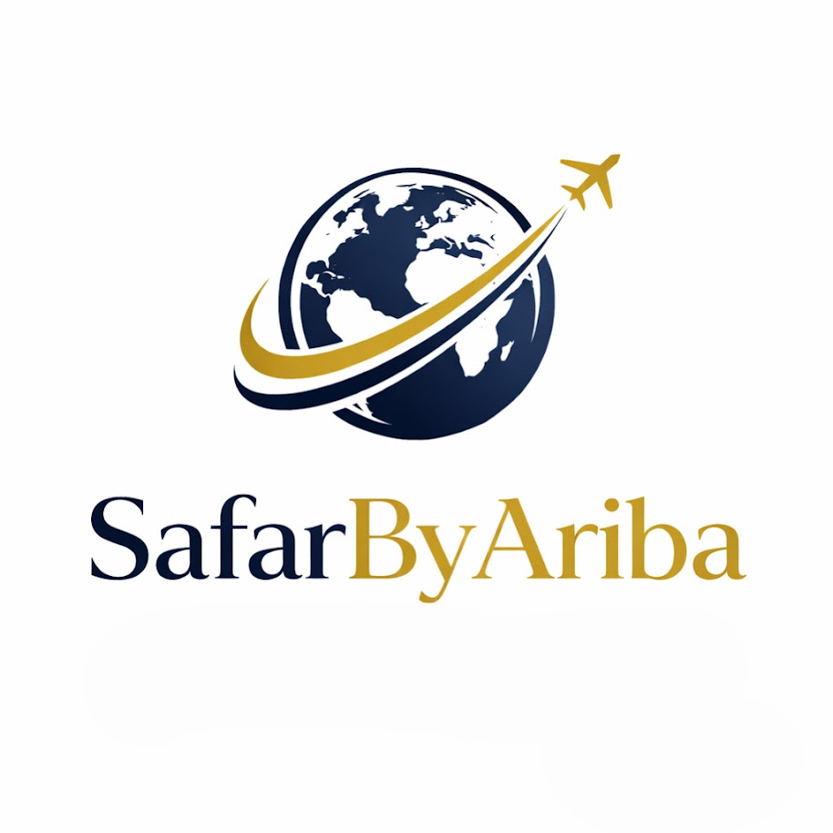

<div align="center">



# SafarByAriba

### Premium Visa & Travel Consulting Website

A modern, multilingual landing page for **SafarByAriba**, a premium travel and visa consulting service. Built with **HTML, CSS, and Vanilla JavaScript**, the website delivers a luxury-inspired experience while remaining lightweight, fast, and easy to deploy.


</div>

---

## 📖 Overview

SafarByAriba is a fully responsive marketing website designed for a visa and travel consultancy. It combines elegant visuals with a clean user experience to showcase services, collect consultation requests, and provide visitors with an effortless browsing experience across desktop and mobile devices.

The project is intentionally built without frameworks, making it lightweight, performant, and simple to maintain while still offering a polished, premium interface.

---

## ✨ Features

- 🌍 Multilingual interface
  - English
  - French
  - Arabic
- ↔️ Automatic RTL support for Arabic
- 📱 Fully responsive layout
- 🎨 Premium luxury-inspired design
- 📩 Consultation request form powered by Netlify Forms
- 🛡️ Built-in spam protection using Netlify Honeypot
- 💬 Floating WhatsApp contact button
- 📌 Sticky navigation bar
- 🍔 Mobile navigation menu
- 💾 Language preference saved with Local Storage
- ⚡ Lightweight with no frameworks or build tools
- 🔍 SEO-friendly metadata and Open Graph tags
- 🔗 Integrated social media links

---

## 🛠 Tech Stack

| Category | Technology |
|----------|------------|
| Markup | HTML5 |
| Styling | CSS3 |
| Programming | Vanilla JavaScript |
| Forms | Netlify Forms |
| Hosting | Netlify |
| Fonts | Google Fonts |

---

## 📂 Project Structure

```text
SafarByAriba/
│
├── favicon.png
├── hero-passport.jpg
├── process-hallway.jpg
│
├── index.html
├── styles.css
├── script.js
│
└── README.md
```

---

## 🚀 Getting Started

Clone the repository

```bash
git clone https://github.com/yourusername/safarbyariba.git
```

Enter the project directory

```bash
cd safarbyariba
```

Open the project

```text
index.html
```

or launch it with your preferred local development server such as **VS Code Live Server**.

---

## 🌐 Deployment

This project is optimized for deployment on **Netlify**.

1. Push the repository to GitHub.
2. Connect the repository to Netlify.
3. Deploy the site.
4. Netlify automatically detects the contact form.
5. Every future push automatically triggers a new deployment.

No server configuration is required.

---

## 📩 Contact Form

The consultation form is powered entirely by **Netlify Forms**, allowing form submissions without building a backend.

Features include:

- Hidden build-time form detection
- Honeypot spam protection
- Automatic submission handling
- Submission dashboard inside Netlify
- Disabled submit button while sending

---

## 🌍 Internationalization

The website includes built-in multilingual support.

Supported languages:

- 🇺🇸 English
- 🇫🇷 French
- 🇲🇦 Arabic

Language switching is handled through HTML `data-*` attributes and JavaScript.

Additional functionality includes:

- Automatic RTL layout switching
- Language preference persistence using Local Storage
- Dynamic text replacement without page reloads

---

## 📱 Responsive Design

The interface has been optimized for:

- Desktop
- Laptop
- Tablet
- Mobile devices

Responsive improvements include:

- Adaptive navigation
- Responsive typography
- Flexible grid layouts
- Mobile-first spacing
- Touch-friendly controls

---

## 🎨 Design Philosophy

The visual identity draws inspiration from luxury travel agencies and premium concierge services.

Key design elements include:

- Elegant serif typography
- Navy & gold color palette
- Editorial-inspired layouts
- Large photography
- Spacious whitespace
- Smooth interactions
- Professional business presentation

---

## ⚡ Performance

- No frontend frameworks
- No external UI libraries
- No build tools
- Lightweight assets
- Fast initial load
- Simple deployment
- Easy maintenance

---

## 🔮 Future Improvements

- Google Maps integration
- Online appointment booking
- Client dashboard
- Testimonials section
- Blog & travel articles
- CMS integration
- Dark mode
- Analytics dashboard
- Additional language support

---

## 📄 License

This project is maintained for **SafarByAriba**.

All rights reserved unless otherwise specified.

---

## 👨‍💻 Author

**Aymen Hakkaoui**

Software Engineer • Full Stack Developer

Live website:https://safarbyariba.com/
---

<div align="center">

### Built with ❤️ for SafarByAriba

**Luxury Travel • Visa Consulting • International Mobility**

</div>
